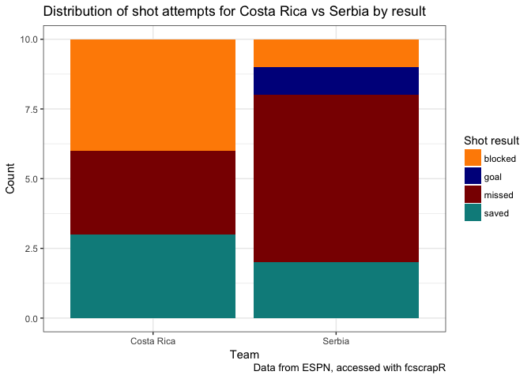

<!-- README.md is generated from README.Rmd. Please edit that file -->

# Introducing fcscrapR

The goal of fcscrapR is to allow R users quick access to the commentary
for each soccer game available on ESPN. The commentary data includes
basic events such as shot attempts, substitutions, fouls, cards,
corners, and video reviews along with information about the players
involved. The data can be accessed in-game as ESPN updates their match
commentary. This package was created to help get data in the hands of
soccer fans to do their own analysis and contribute to reproducible
metrics.

## Installation

You can install `fcscrapR` from github with:

``` r
# install.packages("devtools")
devtools::install_github("ryurko/fcscrapR")
```

## Example game scraping

Here’s an example of how to scrape a game using `fcscrapR`. The
workhorse function of the package is `scrape_commentary()` which takes
in a game id. This game id is located in the url for a game, such as the
group stage match between Serbia and Costa Rica in the 2018 World Cup:
<http://www.espn.com/soccer/commentary?gameId=498194>

Using this game id, we can easily grab the commentary data frame:

``` r
library(fcscrapR)
#> Loading required package: magrittr
srb_crc_commentary <- scrape_commentary(498194)
```

Check out the documentation for `scrape_commentary()` for a description
of all of the columns in the commentary data:

``` r
colnames(srb_crc_commentary)
#>  [1] "game_id"                 "commentary"             
#>  [3] "match_time"              "team_one"               
#>  [5] "team_two"                "team_one_score"         
#>  [7] "team_two_score"          "half_end"               
#>  [9] "match_end"               "half_begins"            
#> [11] "shot_attempt"            "penalty_shot"           
#> [13] "shot_result"             "shot_by_player"         
#> [15] "shot_by_team"            "shot_with"              
#> [17] "shot_where"              "net_location"           
#> [19] "assist_by_player"        "foul"                   
#> [21] "foul_by_player"          "foul_by_team"           
#> [23] "follow_set_piece"        "assist_type"            
#> [25] "follow_corner"           "offside"                
#> [27] "offside_team"            "offside_player"         
#> [29] "offside_pass_from"       "shown_card"             
#> [31] "card_type"               "card_player"            
#> [33] "card_team"               "video_review"           
#> [35] "video_review_event"      "video_review_result"    
#> [37] "delay_in_match"          "delay_team"             
#> [39] "free_kick_won"           "free_kick_player"       
#> [41] "free_kick_team"          "free_kick_where"        
#> [43] "corner"                  "corner_team"            
#> [45] "corner_conceded_by"      "substitution"           
#> [47] "sub_injury"              "sub_team"               
#> [49] "sub_player"              "replaced_player"        
#> [51] "penalty"                 "team_drew_penalty"      
#> [53] "player_drew_penalty"     "player_conceded_penalty"
#> [55] "team_conceded_penalty"   "half"                   
#> [57] "comment_id"              "match_time_numeric"
```

Can quickly make a chart showing the difference in shot attempts for
each team by the outcome:

``` r
# install.packages("ggplot2")
library(ggplot2)
srb_crc_commentary %>%
  dplyr::filter(!is.na(shot_result)) %>%
  ggplot(aes(x = shot_by_team, fill = shot_result)) +
  geom_bar() + labs(x = "Team", y = "Count", 
                    fill = "Shot result") +
  scale_fill_manual(values = c("darkorange", "darkblue", "darkred", "darkcyan")) +
  theme_bw()
```

<!-- -->

## Gather Game IDs

The only function available currently to get game ids is
`scrape_scoreboard_ids()` which pulls the game ids for all soccer
matches on ESPN’s soccer scoreboard:
<http://www.espn.com/soccer/scoreboard>

Example from running it on June 20th, 2018:

``` r
scrape_scoreboard_ids()
#> Loading required package: XML
#> Loading required package: RCurl
#> Loading required package: bitops
#>  [1] "498185" "498184" "498183" "511619" "511617" "511613" "511620"
#>  [8] "504476" "510974" "510985" "503290" "503289"
```

## Acknowledgements

Many thanks to the sports analytics community on Twitter for guiding me
to various resources of soccer data. Big thanks to [Brendan
Kent](https://twitter.com/brendankent) for pointing me to the commentary
data.
